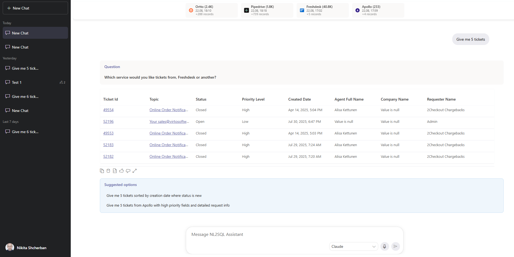
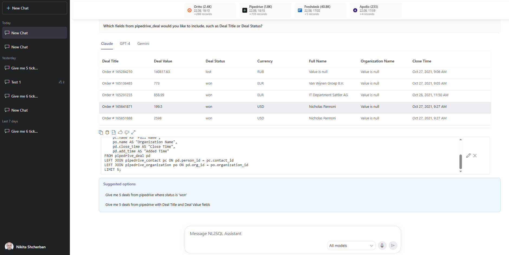

# Virto NL2SQL - Natural Language to SQL Query Generator


## 📖 Overview

NL2SQL is a comprehensive data synchronization and AI-powered SQL generation platform that enables users to interact with databases using natural language queries. The system consists of three main components: a modern React frontend, a robust .NET Core backend, and an intelligent Vanna AI Python server.







### Technologies used

- **Frontend:**
  - **React** — Component-based UI library used to build dynamic interfaces and the chat UX.
  - **TypeScript** — Adds static types to JS for safer, self-documented code across the frontend.
  - **Vite** — Fast development server and build tool used for HMR and quick builds.
  - **Fluent UI** — Microsoft React component library for consistent, accessible, and themeable UI components.

- **Backend:**
  - **.NET (C# / ASP.NET Core)** — API surface, background workers, and business logic implemented in C# for performance and type safety.
  - **Entity Framework Core** — ORM used to map entities, manage migrations, and simplify data access patterns.

- **Server (AI):**
  - **Python** — Language for AI orchestration, data processing, and model glue code.
  - **Flask** — Lightweight web framework exposing inference, health-check, and management endpoints for the Vanna AI server.
  - **Vanna AI** — Orchestration and model logic that generates SQL from natural language and handles embeddings/semantic tasks.

- **Databases:**
  - **PostgreSQL / SQL Server** — Primary relational database(s) for storing synchronized data, application state, and query results.
  - **Qdrant (vector database)** — Stores vector embeddings and provides nearest-neighbor search for semantic features and retrieval-augmented generation.

### Key Features

- **Data Synchronization**: Seamlessly sync data from 4 external services (Apollo, Freshdesk, Ortto, Pipedrive)
- **AI-Powered SQL Generation**: Convert natural language queries to SQL using advanced AI models
- **Real-time Query Execution**: Execute generated SQL queries and return formatted results
- **Chat Interface**: Interactive chat experience for database querying
- **Service Management**: Configure and manage external service connections
- **Background Processing**: Automated data synchronization with background services

## Architecture


### External Service Integrations

- **Apollo**: Contact and organization management
- **Freshdesk**: Customer support ticket management
- **Ortto**: Marketing automation and customer data
- **Pipedrive**: CRM and sales pipeline management

## Getting Started

### Prerequisites

- Node.js 16+ and npm/yarn
- .NET 8.0 SDK
- Python 3.11+
- PostgreSQL/SQL Server database
- Qdrant vector database
- API keys for external services (Apollo, Freshdesk, Ortto, Pipedrive)

### Installation

1. **Clone the repository**
   ```bash
   git clone https://github.com/your-username/nl2sql.git
   cd nl2sql
   ```

2. **Frontend Setup**
   ```bash
   cd NL2SQL
   npm install
   ```

3. **Backend Setup**
   ```bash
   cd NL2SQL.WebApp
   dotnet restore
   ```

4. **Python AI Server Setup**
   ```bash
    cd VannaPython
    python -m venv .venv
    .\.venv\Scripts\Activate.ps1
    pip install -r requirements.txt
   ```

### Build

1. **Frontend configuration**

- Create a `.env.local` file in the `NL2SQL/` folder to override development values without committing secrets.
- Copy the relevant keys from `NL2SQL/.env` and set `VITE_BASE_URL` to your backend API endpoint.
- The frontend uses Vite so environment variables must start with `VITE_` to be exposed to client code.

Example `.env.local` (place in `NL2SQL/.env.local`):
```properties
VITE_BASE_URL=
VITE_AZURE_CLIENT_ID=
VITE_AZURE_TENANT_ID=
VITE_AZURE_API_SCOPE=
```

- Environment variable descriptions (frontend):
  - `VITE_BASE_URL` — Base URL the frontend uses for API requests (include scheme and `/api` if backend expects it). Example: `https://localhost:7074/api`.
  - `VITE_AZURE_CLIENT_ID` — Azure AD application (client) ID used by the frontend to initialize authentication (MSAL) and request tokens.
  - `VITE_AZURE_TENANT_ID` — Azure AD tenant (directory) ID that scopes authentication requests to your Azure AD instance.
  - `VITE_AZURE_API_SCOPE` — The scope/audience the frontend requests when acquiring access tokens for the backend 

2. **Backend configuration**

- Copy `NL2SQL.WebApp/appsettings.example.json` to `NL2SQL.WebApp/appsettings.Development.json` (or `appsettings.json`) and fill in the placeholders with your local values.

- Key sections in `appsettings.Example.json` and what to set:
  - `ConnectionStrings:AzureSqlConnection` — Your relational DB connection string (Postgres or SQL Server). 
  - `AzureAd` — Azure AD settings for token validation and protected API endpoints:
    - `TenantId`: your Azure AD tenant GUID
    - `ClientId`: backend app registration (used for audience validation)
    - `Audience`: the API audience URI (usually `api://<backend-client-id>`)
  - `OpenAI:ApiKey` — API key for OpenAI (or your chosen LLM provider) used by the backend for text generation.
  - `VannaAzure` — Flask AI server endpoint and API key, used when backend forwards requests to Vanna AI server.
  - `AzureSpeech`, `AzureTranslator` — Optional Azure Cognitive keys/regions if you use speech/translation features.
  - `Pipedrive`, `Apollo`, `Ortto`, `Freshdesk` — External service API credentials and base URLs required for data synchronization.

- After editing `appsettings.Development.json`, restart the backend so it loads the new settings.

3. **Python AI server configuration (Vanna AI)**

This project uses a dedicated Vanna AI Python server (located in `VannaPython/`) to run model orchestration, embeddings, and inference. The server reads runtime settings from a `.env` file in `VannaPython/`.

Place your runtime values in `NL2SQL.WebApp/VannaPython/.env`.

Example `VannaPython/.env` (fill values, keep keys only — do NOT paste real secrets into source control):
```properties
# OpenAI / LLM provider
OPENAI_API_KEY=<your-openai-api-key>
OPENAI_MODEL=gpt-5
GEMINI_API_KEY=<your-gemini-api-key>

# Optional local model endpoint (example defog/sqlcoder-7b-2)
API_LOCAL_MODEL=<optional-local-or-remote-model-endpoint>
API_KEY_AI_MODEL=<optional-api-key-for-local-model>

# Postgres connection used by Vanna for any DB access (when needed)
POSTGRES_USER=<db-user>
POSTGRES_PASSWORD=<db-password>
POSTGRES_SSLMODE=require
POSTGRES_HOST=<db-host>
POSTGRES_PORT=5432
POSTGRES_DB=<db-name>

# Qdrant (vector DB) for embeddings
QDRANT_API_KEY=<qdrant-api-key>
QDRANT_HOST=https://<qdrant-host>:6333

# Allowed origin for CORS (.net backend URL)
ALLOWED_ORIGIN=

# Optional routing/keys for integrations
DOTNET_API_KEY=<shared-api-key-if-backend-calls-vanna>
OPENROUTER_API_KEY=<openrouter-key-if-used>
OPENROUTER_MODEL=
OPENROUTER_API_URL=
```

What each variable does (short):
- `OPENAI_API_KEY` / `OPENAI_MODEL` — API key and model name the Vanna server uses for text generation if using OpenAI.
- `API_LOCAL_MODEL`, `API_KEY_AI_MODEL` — URL and key for a self-hosted or cloud-hosted model endpoint (used instead of OpenAI when set).
- `POSTGRES_*` — Postgres connection pieces if Vanna needs DB access (schema, metadata, or to store job/state). You can also provide a single `DATABASE_URL` instead if your code expects it.
- `QDRANT_HOST`, `QDRANT_API_KEY` — Vector database endpoint and key used to store and query embeddings.
- `ALLOWED_ORIGIN` — Allowed by the Vanna server for CORS.
- `DOTNET_API_KEY` — Shared API key for requests from the .NET backend (if used).
- `OPENROUTER_*` — Optional keys and endpoint if you use OpenRouter as an LLM provider.

### Database Migration

Before running the application for the first time, you need to initialize the database schema.

1. Navigate to the backend project:
   ```bash
   cd NL2SQL.WebApp
   ```

2. Apply migrations to your configured database:
   ```bash
   dotnet ef database update
   ```
   
## Running the Application

1. **Start the Database**
   ```bash
   # Ensure your Qdrant and PostgresSql databases are running
   ```

2. **Start the Backend**
   ```bash
   cd NL2SQL.WebApp
   dotnet run
   ```

3. **Start the AI Server**
   ```bash
   cd VannaPython
   python app.py
   ```

4. **Start the Frontend**
   ```bash
   cd NL2SQL
   npm run dev
   ```

## 📝 License

This project is released under the VirtoSoftware Community License (VCL) v1.0.

Short summary (see full license in the repository `LICENSE` file):

- Grant: Free for personal projects and internal organizational use; you may modify, fork, and contribute.
- Attribution: All copies and derivatives must retain this license text and copyright notice and indicate changes.
- Restrictions: Commercial use (SaaS, paid redistribution, or enterprise integration) is not allowed without a separate commercial license from VirtoSoftware.
- Contributions: Contributions are licensed under the same VCL terms.
- Warranty: The Software is provided "AS IS" without warranty.
- Termination: License terminates on breach; stop using the Software upon termination.
- Change of license: On January 1, 2029 the software will be re-licensed under the Apache License 2.0.

For the full license text, see the `LICENSE` file.

Contact for commercial licensing: legal@virtosoftware.com